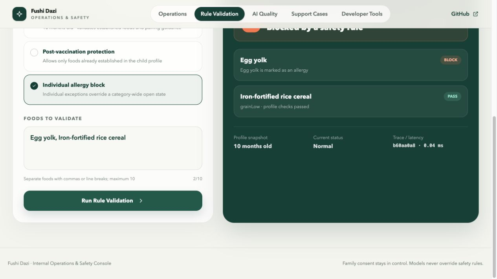
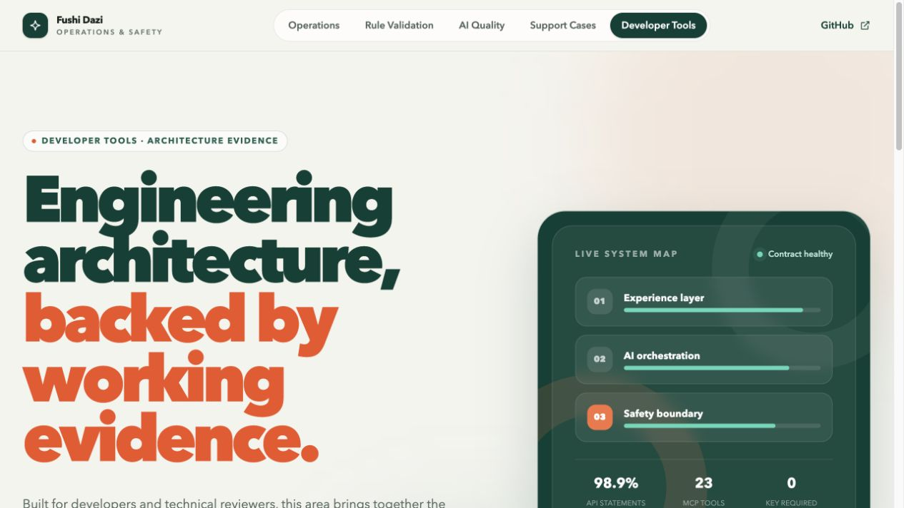
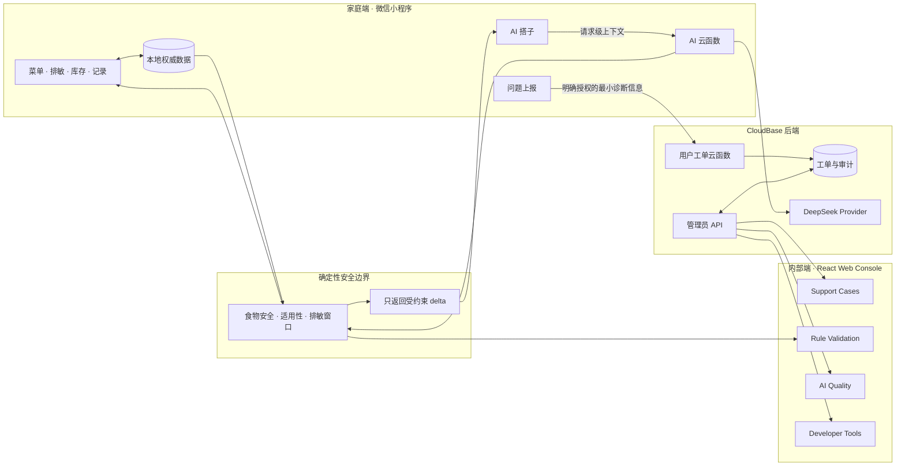

# 辅食搭子（Fushi Dazi）

辅食搭子是一套面向 4–24 月龄宝宝家庭的辅食辅助决策产品，由家长使用的微信小程序和内部人员使用的 Web Console 组成。产品把菜单规划、排敏、饮食记录、AI 问答和问题反馈串成一条真实链路，并用确定性规则守住食物安全边界。

微信小程序 v1.0.3 已正式上线，截至 2026 年 8 月累计用户超过 300 人。仓库同时包含尚未随正式版发布的下一版本功能；具体范围与发布门槛见 [PRD](./PRD.md)。

[线上管理后台](https://cloud1-d8g02cdnld86f3823-1451658149.tcloudbaseapp.com/admin/) · [架构决策记录](./docs/adr/README.md) · [AI 数据事故复盘](./docs/postmortem-ai-local-data-overwrite.md)

## 产品由两个端组成

| 产品端 | 使用者 | 主要场景 | 核心能力 |
|---|---|---|---|
| 微信小程序 | 宝宝家长和实际照护者 | 今天吃什么、如何排敏、库存是否够、吃完如何记录、出现不适后怎么办 | 建档、菜单与周计划、食谱、库存、饮食打卡、排敏、反应记录、AI 问答和问题上报 |
| Web Console | 产品运营、安全支持和工程人员 | 用户反馈后如何定位问题、复核安全事件、观察 AI 质量并留下处理记录 | 支持工单、安全规则验证、Trace、离线评测、审计和开发者工具 |

小程序承载家庭每天真正发生的操作；Web Console 是内部运营与安全工具，不是家长端的网页版，也没有代替家长修改永久过敏档案的入口。控制台界面使用英文，方便直接展示工程架构、运行证据和操作边界。

## 关键页面

<table>
  <tr>
    <td width="50%">
      
      <br /><sub><strong>Rule Validation</strong>：用隔离的合成档案验证过敏、观察期和食物适用性规则。</sub>
    </td>
    <td width="50%">
      
      <br /><sub><strong>Developer Tools</strong>：集中展示契约、AI 编排、安全边界和质量门禁。</sub>
    </td>
  </tr>
</table>

截图只使用合成数据和工程指标，不包含真实家庭档案、工单内容或管理员身份信息。

## 一条完整的产品链路

1. 家长在小程序建立宝宝档案，记录已吃食材、排敏状态和家庭库存。
2. 系统结合档案和确定性规则生成菜单；AI 可以理解问题、查找食谱和调用受限工具，但不能越过规则推荐不安全食材。
3. 家长发现菜单或 AI 回答存在疑问时，可在小程序选择问题类型，并明确同意上传最小诊断信息。
4. 工单进入 Web Console。支持人员查看问题、结构化证据、规则 Trace 和处理时间线。
5. 普通问题由支持人员解决；关键安全问题必须升级给安全审核人。成功和被拒绝的状态变更都会留下审计记录。
6. 工单关闭后，小程序可以查询最新状态；后台不能直接改写家长设备上的档案或历史饮食记录。

## 端到端架构



这套架构有两个关键约束：

- **规则先于模型**：LLM 负责理解意图、选择工具和解释结果；能否食用、食谱是否适用、排敏状态如何变化由 TypeScript 确定性规则判断。
- **本地数据是家庭主数据的唯一权威副本**：AI 云函数只处理当次请求，不从空的云端状态初始化或覆盖菜单、排敏档案和历史记录。已打卡餐次是不可变历史事实，除非用户明确编辑该条记录。

## 哪些是真实能力，哪些是合成验证

| 范围 | 当前状态 | 边界 |
|---|---|---|
| 微信小程序 v1.0.3 | 已正式上线 | 正式版包含家庭核心流程和线上 AI；仓库中的 v1.0.4 尚未发布 |
| AI Provider | CloudBase 云函数连接 DeepSeek | 请求前展示数据范围；模型不能绕过确定性安全规则 |
| 支持工单 | 已完成“小程序提交 → 后台处理 → 小程序查询关闭状态”的线上验收 | 只上传用户明确授权的结构化诊断信息 |
| 管理员认证与工单存储 | CloudBase Access Token、UID 白名单和事务数据库 | 浏览器不保存管理员密码，也不能自行切换角色 |
| Operations、Rule Validation、AI Quality | 本地可运行的工程与运营验证面 | 代表性档案、发布候选和评测输入为隔离的合成数据 |
| Mock provider / mock-policy 评测 | 无模型密钥即可重复运行 | 用于验证工具路由、安全阻断和失败路径，不代表线上模型准确率或容量 |
| MCP Server | 可运行的开发者工具层 | 与正式小程序用户档案隔离，不读取真实家庭数据 |

## 技术设计

- **Contract-first API**：`packages/contracts/` 用 Zod 定义输入输出，oRPC 同时服务 Express API 与 React 客户端，OpenAPI 由同一契约生成。
- **清晰的状态边界**：TanStack Query 管理服务端数据，Zustand 只管理页面内交互状态；加载失败时不展示旧工单，也不允许执行状态变更。
- **可审计的高风险操作**：后台写入携带版本号，关键安全工单需要安全审核角色，所有允许和拒绝结果均进入时间线。
- **隐私最小化**：Trace 使用 `summary-only` 模式；支持工单只接收经用户同意的最小诊断信息。
- **可复用的 AI 工程流程**：MCP Server、项目 Skill、ADR 和 `AGENTS.md` 把安全检查、工具调用、负向测试与交付门禁固化为可复用流程。
- **严格类型边界**：共享规则、Contracts、API、React Console 和 MCP Server 均启用 TypeScript strict；历史小程序页面采用兼容配置并渐进迁移。

## 快速开始

### 1. 安装与快速验收

```bash
pnpm install
npm run verify:quick
```

`verify:quick` 会验证共享规则 strict/noImplicitAny、workspace 构建、MCP TypeScript、46 项工具/资源冒烟测试和 11 步有状态集成流程。它不需要模型密钥，mock provider 会被明确标记。

### 2. 运行 Web Console

打开两个终端：

```bash
pnpm run api:dev
```

```bash
pnpm run web:dev
```

访问 `http://127.0.0.1:4173/`，可依次查看：

- `/safety`：验证蜂蜜、个体过敏或观察期食材被确定性规则阻断。
- `/observability`：查看 provider 状态、summary-only Trace 和固定回归结果。
- `/support`：体验工单认领、升级、安全复核与关闭流程。
- `/developer`：查看 OpenAPI、MCP 清单、架构和质量门禁。

线上构建只开放真实支持工单流程，不暴露本地合成开发者场景。管理员账号需要先加入服务端 UID 白名单。

### 3. 运行微信小程序

1. 安装[微信开发者工具](https://developers.weixin.qq.com/miniprogram/dev/devtools/download.html)。
2. 选择“小程序” → “导入项目”，目录选择本仓库根目录。
3. AppID 会从 `project.config.json` 读取；点击“预览”可生成真机二维码。

正式用户通过欢迎流程创建宝宝档案；请勿用真实用户数据运行开发者合成场景或测试脚本。

## 质量门禁与运行证据

提交前运行完整质量门禁：

```bash
npm run verify
```

首次运行浏览器测试前安装 Chromium：

```bash
pnpm --filter @fushi/web-console exec playwright install chromium
```

完整门禁覆盖小程序构建与回归、Contracts、72 项 API 测试、43 项 React/MSW 测试、MCP 构建与覆盖率、46 项冒烟测试、11 步集成流程以及 3 项 Chromium E2E。家长核心回归覆盖菜单生成、打卡扣库存、72 小时反应回溯、进入观察期，以及菜单重算后保留已打卡餐并排除可疑食材。

- [MCP Server](./mcp-server/README.md)：23 个工具、10 个资源、3 个提示词，以及固定离线评估集。
- [Contract-first API](./apps/api-server/README.md)：Zod、oRPC、Express、OpenAPI 与确定性安全规则。
- [React Web Console](./apps/web-console/README.md)：React 19、React Router、TanStack Query、Zustand、Tailwind CSS、MSW 与 Playwright。
- [安全变更 Skill](./skills/fushi-safety-change/SKILL.md)：安全敏感变更的契约、实现、负向测试和交付检查。
- [Architecture Decision Records](./docs/adr/README.md)：记录规则边界、不可逆确认、contract-first 和离线评测取舍。

## 当前内容规模

- 29 个食物分类
- 32 种基础食材
- 127 道食谱
- 9 条食材搭配禁忌

## 项目结构

```text
fushi-ditu/
├── apps/
│   ├── api-server/             # Express + oRPC contract-first API
│   └── web-console/            # React operations, safety and developer console
├── packages/contracts/         # 共享 Zod/oRPC 输入输出契约
├── cloudfunctions/             # AI、用户工单与管理员 API 云函数
├── data/                       # 食材、食谱、分类与搭配禁忌
├── utils/                      # 计划、记录、反应和安全规则
├── pages/                      # 微信小程序页面
├── mcp-server/                 # MCP 工具、资源、提示词与评估
├── skills/                     # 项目安全变更流程
└── docs/                       # ADR、复盘与运行说明
```

## 当前限制

- 小程序家庭主数据仍以本地缓存为主，不提供完整的跨设备同步、云端备份或恢复。
- AI 调用会把页面列明的本地业务数据作为当次请求上下文交给云函数和模型处理；云函数不保存到 `user_data`，也不会用云端空状态覆盖本地数据。
- 后台质量页中的固定评测和发布候选是工程验证证据，不等同于生产监控平台、真实模型 SLA 或自动部署系统。
- 仓库当前版本标记为 v1.0.4，尚未随已上线的 v1.0.3 发布。
