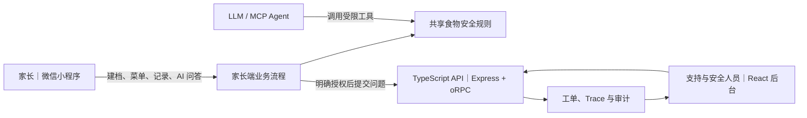

# 辅食搭子

辅食搭子是一套面向 4–24 月龄宝宝家庭的辅食辅助决策产品，由家长使用的微信小程序和内部人员使用的 Web 管理后台组成。项目用一条真实业务链路展示：AI 如何参与日常帮助、确定性规则如何保护安全、用户问题如何进入后台并被追踪处理。

产品范围、当前完成度和发布门槛见 [PRD.md](./PRD.md)。

## 先看产品：两个端分别做什么

| 产品端 | 谁使用 | 解决的问题 | 主要能力 |
|---|---|---|---|
| 微信小程序 | 宝宝家长和实际照护者 | 每天吃什么、如何排敏、库存是否够、吃完后如何记录，以及出现反应后怎么办 | 建档、菜单与周计划、食谱、库存、饮食打卡、排敏、反应记录、AI 问答和问题上报 |
| Web 管理后台 | 产品运营、安全支持和工程人员 | 当 AI 回答、菜单结果或数据状态出现疑问时，如何定位原因、人工复核并留下处理记录 | 工单处理、安全规则验证、AI 质量与 Trace、发布前评测、审计和开发者工具 |

小程序负责家庭每天真正发生的使用场景；后台负责产品出现问题后的支持、安全和质量闭环。后台不会代替家长修改宝宝的永久过敏档案。

## 一条完整的用户故事

1. 家长在小程序建立宝宝档案，记录已吃食材、排敏状态和家庭库存。
2. 系统结合档案和确定性食物安全规则生成菜单；AI 可以回答问题、查食谱或调用工具，但不能越过规则推荐不安全食材。
3. 如果家长发现菜单疑似包含不安全食材，或 AI 回答缺少安全提醒，可以在小程序中选择问题类型并明确同意上传最小诊断信息。
4. 工单进入 Web 管理后台。支持人员查看问题、关联的规则 Trace、档案版本和菜单日期，记录调查结论。
5. 普通问题由支持人员解决；关键安全问题必须升级给安全审核人。每次成功或被拒绝的操作都会进入处理时间线。

这条链路让用户不需要离开产品即可报告问题，也让内部人员能够基于应用上下文定位、处理和审计，而不是依赖零散截图或重复沟通。

进一步阅读：[架构决策记录](./docs/adr/README.md) · [产品需求文档](./PRD.md)

## 两个端如何连接



共享规则是两个端之间最重要的边界：小程序用它约束菜单和 AI 工具，后台用它复现和解释当时为什么放行或阻断。

## 技术实现为什么这样设计

- **AI 与规则分工**：LLM 负责理解自然语言、选择工具和解释结果；能否食用、食谱是否适用、排敏状态如何变化由 TypeScript 确定性规则判断。这让高风险结果可解释、可测试，也能在没有模型密钥时运行。
- **AI 数据授权**：真实云端发送前列明本地上下文范围、DeepSeek 服务商和请求级非持久化边界；拒绝时不会调用云函数，授权保存在本机并可撤回。
- **前后端共享契约**：`packages/contracts/` 用 Zod 定义输入输出，再由 oRPC 同时服务 Express API 和 React 客户端，避免后台页面和服务端各写一套类型。
- **服务端状态与页面状态分开**：React Query 管理工单、Trace 和评测等服务端数据；Zustand 只管理页面内的实验输入，减少状态来源混乱。
- **安全操作可追踪**：家长上传诊断信息需要明确同意；后台写入携带版本号；关键安全工单需要安全审核角色；所有允许和拒绝结果都有审计记录。
- **AI 开发流程可以复用**：MCP Server、项目 Skill 和 `AGENTS.md` 不只是演示名词，它们把查档案、检查安全、生成菜单和安全变更检查等重复工作固化为团队可复用工具。

## 工程质量

- **类型安全**：Zod + oRPC 作为 API 契约的单一来源，React 与 Express 不重复维护请求和响应类型。
- **严格类型边界**：`data/` 与 `utils/` 的确定性规则由根目录 `tsconfig.strict-core.json` 以 `strict` + `noImplicitAny` 独立校验；Contracts、API、React 控制台和 MCP Server 同样使用 strict。历史小程序页面仍采用兼容配置并渐进迁移，不把局部宽松配置描述成整仓 strict。
- **自动化测试**：Vitest 覆盖规则和 API，MSW 覆盖前端成功与失败路径，Playwright 验证 React→API→规则的真实浏览器链路。
- **离线可运行**：没有模型密钥时使用明确标注的 mock provider，确定性安全规则、工单流程和固定评估仍可运行。
- **隐私最小化**：支持工单只上传用户明确授权的结构化诊断信息；Trace 使用 `summary-only` 模式，不保存宝宝姓名、食材明细或自由备注。
- **当前边界**：本地运行默认使用单节点文件持久化和演示会话；线上支持工单使用 CloudBase 事务数据库、隔离的用户/管理员 HTTP 云函数和 Access Token 管理员认证，并已完成一条从小程序提交到后台关闭、再由小程序查询状态的真实链路验收。小程序主数据仍以本地缓存为主，尚未实现完整的跨设备双向同步。

## 快速运行运营与安全控制台

```bash
pnpm install
pnpm run api:dev
```

另开一个终端：

```bash
pnpm run web:dev
```

访问 `http://127.0.0.1:4173/`，建议依次查看运营总览、`/safety` 规则验证、`/observability` AI 质量、`/support` 家庭支持和 `/developer` 开发者工具。

线上支持工单后台部署在 [CloudBase `/admin`](https://cloud1-d8g02cdnld86f3823-1451658149.tcloudbaseapp.com/admin/)，仅接受已加入服务端 UID 白名单的管理员账号。线上构建不会暴露本地合成开发者场景。

## 本地质量门禁

无需 GitHub Actions 或付费服务，在项目根目录执行：

```bash
npm run verify
```

首次运行浏览器测试前执行：

```bash
pnpm --filter @fushi/web-console exec playwright install chromium
```

质量门禁会依次完成小程序 TypeScript 构建、家长核心流程与隐私回归、pnpm workspace 构建、72 项 API 测试、40 项 React/MSW 测试、MCP Server 构建与测试、46 项冒烟测试、11 步集成流程和 3 项真实 Chromium E2E。家长核心流程回归覆盖菜单生成、打卡扣库存、72 小时反应回溯、进入观察期，以及菜单重算后保留已打卡餐并排除可疑食材。当前 API 行覆盖率为 96.63%，React 控制台行覆盖率为 89.88%。本项目以本地可重复证据为验收标准，不把未运行的远程 CI 当作交付结果。

## 工程组成与运行证据

- [MCP Server](./mcp-server/README.md)：23 个工具、10 个资源、3 个提示词，展示 rule-first / LLM-second 的 agentic workflow；固定离线评估集量化工具选择、安全阻断、grounding 代理和端到端成功率。
- [Contract-first API](./apps/api-server/README.md)：pnpm workspace、Zod、oRPC、Express 与 OpenAPI，复用同一套确定性安全规则。
- [React 运营与安全控制台](./apps/web-console/README.md)：React 19、React Router、TanStack Query、Zustand、Tailwind CSS 与 MSW；主界面服务支持工单、内部运营和安全验证，架构证据与可变更的家庭合成流程隔离在开发者专区。
- [辅食安全变更 Skill](./skills/fushi-safety-change/SKILL.md)：把安全敏感功能的契约、实现、负向测试和交付检查固化为可复用流程。
- [AGENTS.md](./AGENTS.md)：定义代码分层、AI 决策边界、质量门禁和 Git 协作规范。
- [Architecture Decision Records](./docs/adr/README.md)：记录规则边界、contract-first、不可逆确认与离线评估的关键取舍。
- Mock provider：无模型密钥也能离线演示，且调用方可以明确识别 mock / live 状态。

## 怎么打开它

1. 下载安装**微信开发者工具**(stable版):
   https://developers.weixin.qq.com/miniprogram/dev/devtools/download.html

2. 打开微信开发者工具 → 选择"小程序" → "导入项目"

3. 项目目录选 `~/fushi-ditu`,AppID 自动识别(`wx622c566b469247cc`)

4. 点"确定"即可看到效果

## 真机调试(扫码到手机看)

1. 在开发者工具点击右上角"预览" → 生成二维码
2. 用本人微信(注册AppID的那个号)扫码
3. 直接在手机上看小程序运行效果

## 当前能做什么

- ✅ 首次建档:宝宝信息 / 已吃食材 / 初始冰箱
- ✅ 今日:菜单 / 单餐替换 / 实际饮食打卡 / 明日预处理 / 排敏下一步
- ✅ 计划:生成与重排 / 采购清单 / 计划预览与复制
- ✅ 冰箱:添加 / 搜索筛选 / 临期与低库存 / 批量处理 / 自动扣减与恢复
- ✅ 记录:饮食与反应时间流 / 7日摘要 / 搜索筛选 / 补记编辑 / 文本导出
- ✅ 排敏:品类与单食材状态 / 尝试窗口 / 观察期 / 过敏与个体例外
- ✅ 食谱库:127 道食谱,支持搜索、分类与详情
- ✅ AI 搭子:线上云函数使用 DeepSeek 正式 provider；安全工具、拒绝路径以及已发布 v1.0.3 的真机完整链路均已通过验收

## 当前内容规模

- 食物分类:29 个
- 基础食材:32 种
- 食谱:127 道
- 搭配禁忌:9 条

正式用户通过欢迎流程创建宝宝档案；MCP Server 的测试档案与小程序数据相互隔离。

## 项目结构

```
fushi-ditu/
├── apps/
│   ├── api-server/             # Express + oRPC contract-first API
│   └── web-console/            # React operations, safety and developer console
├── packages/
│   └── contracts/              # 共享 Zod/oRPC 输入输出契约
├── app.ts                    # 入口,云能力与档案结构初始化
├── app.json                  # 小程序配置
├── app.wxss                  # 全局样式
├── project.config.json       # 项目配置(含 AppID)
├── data/
│   ├── categories.ts         # 食物分类(28类)
│   ├── ingredients.ts        # 食材属性库(32种)
│   ├── recipes.ts            # 食谱库(127道)
│   └── taboos.ts             # 食材搭配禁忌(9条)
├── utils/
│   ├── planner.ts            # 计划与排敏核心规则
│   ├── menuPreview.ts        # 基于共享安全规则的稳定菜单预览
│   ├── journal.ts            # 饮食记录
│   ├── reactions.ts          # 反应记录与回溯
│   └── storage.ts            # 冰箱存储管理
├── cloudfunctions/chat-ai/   # 小程序 AI 云函数
├── docs/                     # ADR、运行说明与端到端演示步骤
├── mcp-server/               # 开发者演示用 MCP Server
└── pages/
    ├── index/                # 今日
    ├── plan/                 # 计划
    ├── ai-chat/              # AI 搭子
    ├── review/               # 饮食与反应记录
    └── me/                   # 我的
```

## 当前限制与发布前待办

- 🚫 小程序主数据仍以本地缓存为主,没有完整的跨设备双向同步
- ⚠️ AI 调用会把本地 7 类业务数据作为当次请求上下文交给云函数和模型处理，但不保存到 `user_data`；当前不提供云端备份或跨设备恢复
- 🛡️ 本地数据是唯一权威副本：云函数只使用请求级内存，只读问答不回写，写工具仅通过 delta 返回实际修改字段，云端不会初始化或覆盖排敏档案、菜单和记录
- ✅ 小程序与 MCP Server TypeScript 构建均通过
- ✅ MCP 冒烟测试 46/46,集成测试 11/11
- [x] 完成线上 AI 云函数与正式模型 provider 的受控核验
- [x] 在已发布 v1.0.3 完成 `本地快照 → 云函数 → 小程序 UI` 真机验收
- [ ] 发布下一版本前统一应用内版本标记；当前仓库 v1.0.4 尚未发布
