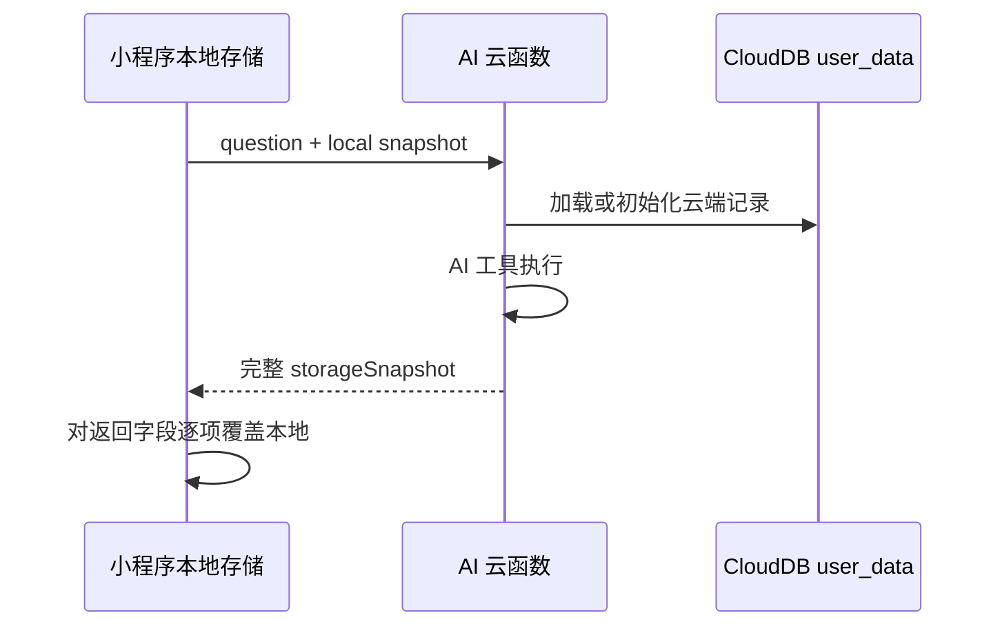
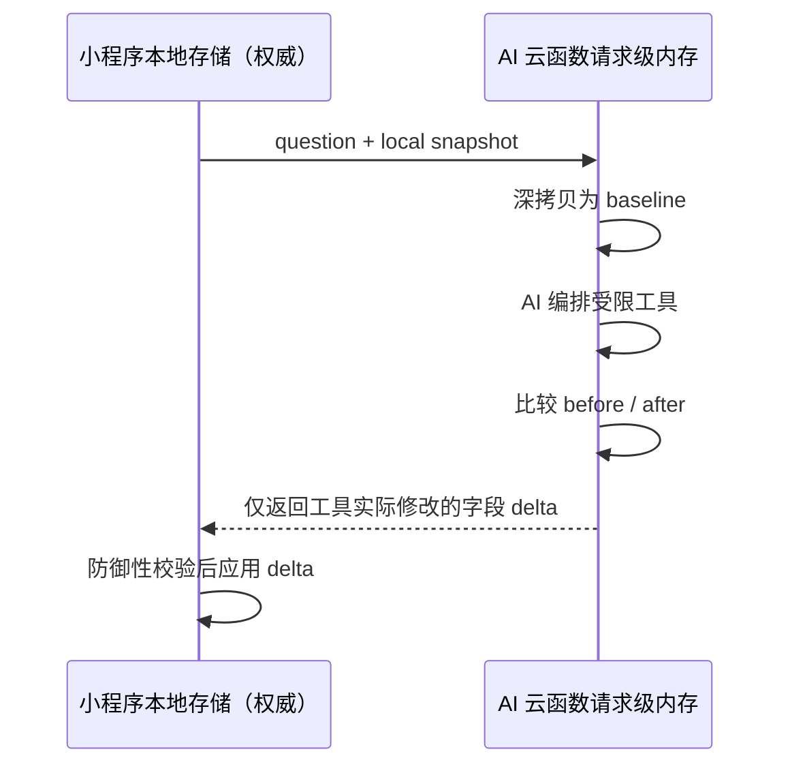

# AI 云函数覆盖本地数据：事故复盘

- 事故类型：用户数据完整性
- 发现日期：2026-08-12
- 影响范围：小程序本地档案、排敏状态和菜单的显示与持久化路径
- 当前状态：已修复、已部署云函数、已完成自动化与正式 v1.0.3 真机验收

## 摘要

正式使用中出现过首页菜单为空、进入计划页后菜单才重新生成，以及排敏档案丢失的现象。调查确认，风险来自 AI 调用后的数据同步协议，而不是菜单规则或 LLM 内容本身。

旧设计同时保留小程序本地存储和云端 `user_data`，AI 响应返回 7 类业务数据的完整 `storageSnapshot`，客户端再逐字段写回本地。当云端记录为空、初始化不完整或只包含部分字段时，客户端仍把响应视为完整权威快照，因而可能以空数组或残缺对象覆盖设备上已有的菜单、档案和记录。

修复后产品明确采用 local-first：设备本地数据是唯一权威副本。云函数以请求携带的快照初始化请求级内存，执行 AI 工具后只返回实际变化的字段 delta；生产路径不再读取或写入 `user_data`。

## 用户影响

已观察到的用户侧表现：

- 首页无法读取原有菜单，呈现空状态。
- 进入计划页重新生成后，菜单才再次出现。
- 已维护的排敏档案可能在 AI 响应写回后丢失。

这些表现会降低用户对菜单和排敏记录的信任。在辅食场景中，排敏档案还是安全规则的重要输入，因此即使规则实现本身没有失效，数据完整性问题也必须按安全相关故障处理。

本项目没有足够的线上遥测来量化受影响用户数、发生次数或持续时间，因此不对这些指标作推测。

## 发现方式

问题由真机使用中的异常状态发现，而不是由自动告警发现。用户指出：云端初始化为空后覆盖了本地数据，首页菜单变空，需要进入计划页才重新出现，同时排敏档案丢失。

这暴露了两个监控缺口：

1. 当时没有记录“响应包含哪些存储字段、客户端实际写入哪些字段”的隐私安全型指标。
2. 测试验证了 AI 工具能读写数据，但没有把“只读调用绝不能改变本地状态”和“残缺云端数据绝不能覆盖完整本地状态”作为协议不变量。

## 故障机制

### 旧协议



关键缺陷不是某一个空值判断，而是协议没有单一数据所有者：

- 小程序页面以本地存储渲染，实际把本地当作权威。
- AI 工具在云端状态上运行，响应又把云端快照当作权威。
- `storageSnapshot` 没有版本、完整性标记或字段级变更语义。
- 客户端无法区分“工具故意清空字段”和“云端从未拥有完整数据”。
- 即使是只读问答，也会返回并应用整份快照，扩大了无关字段被覆盖的范围。

因此，一个 HTTP/云函数层面的成功响应仍可能造成业务数据丢失。

## 根因分析

### 直接原因

客户端把 AI 响应中的完整 `storageSnapshot` 逐字段写入本地，而该快照可能来自空或残缺的云端初始化状态。

### 架构根因

本地存储与 CloudDB 同时承担权威数据源，没有定义冲突时谁获胜，也没有可靠的初始化、版本比较和合并协议。

### 测试根因

早期测试以工具能成功返回结果为主，没有覆盖以下负向不变量：

- 只读 AI 工具返回空变更集。
- 生成菜单只能修改 `weeklyPlan`。
- 记录反应只能修改 `reactions`。
- 缺失或残缺的云端状态不能替换完整本地档案。
- 请求间不能隐式恢复上一次用户数据。

### 促成因素

- 返回字段名表达“快照”，鼓励调用方执行整体同步。
- 客户端通用写回循环把协议错误放大到全部 7 类数据。
- 云端持久化尚未形成完整备份/恢复能力，却已经进入 AI 数据路径。
- 缺少对异常字段收缩、空集合替换和跨请求数据残留的可观测检查。

## 处置与修复

### 1. 明确唯一权威数据源

当前阶段以小程序本地存储为唯一权威副本。云端 AI 不初始化客户端状态，也不提供备份或跨设备恢复。

### 2. 云函数改为请求级内存

生产请求使用 `_localBackup` 的深拷贝初始化 memory shim。请求完成即释放，生产路径不加载 `wx-server-sdk`，也不读取或写入 `user_data`。

### 3. 全量快照改为字段 delta

云函数在工具执行前记录 baseline，执行后比较 7 个允许字段，只返回实际变化的字段：

```text
只读历史查询  -> {}
生成菜单      -> { weeklyPlan }
记录反应      -> { reactions }
```

未变化的 `babyProfile`、历史记录和其他字段不会进入响应，因此客户端没有机会用无关云端值覆盖它们。

### 4. 客户端保留纵深防御

小程序将写回方法改为 `applyToolDelta`，只处理响应中的变更字段；同时保留 `shouldKeepLocalValue` 检查，拒绝明显的“空云端值覆盖非空本地值”。该检查是第二道防线，不替代服务端 delta 协议。

### 5. 收敛产品与隐私承诺

AI 首次调用前明确说明 7 类本地上下文、请求级处理和 DeepSeek 第三方服务商。产品文档不再把 AI 云函数描述为云端同步或备份能力。

## 修复后协议



安全不变量：食材放行、菜单适用性和反应后的状态仍由确定性规则决定；数据边界修复没有把安全决策交给 LLM。

## 验证证据

### 自动化回归

- `test/chat-ai-history-regression.test.js`
  - 只读历史查询返回 `{}`。
  - 菜单生成只返回 `weeklyPlan`。
  - 反应记录只返回 `reactions`。
  - 完整档案、既有饮食记录和反应记录保持不变。
- `test/chat-ai-memory-boundary.test.js`
  - 生产路径不能加载 `wx-server-sdk`。
  - 请求输入对象不会被云端工具原地修改。
  - 响应不携带未变化的 `babyProfile`。
- 根目录 `npm run verify` 覆盖上述回归及完整质量门禁。

### 线上受控验收

- 部署前审计生产 `user_data` 为 0 条，并生成 0 文档备份。
- 只更新 `chat-ai` 云函数，没有发布新的小程序版本。
- 使用虚构档案验证：只读请求返回空变更集；菜单生成只返回 `weeklyPlan`。
- 同一匿名测试身份第一次携带档案可以生成菜单，第二次不携带档案立即得到“档案还没建好”，证明没有恢复上一请求数据。
- 线上 provider 保持 `deepseek / deepseek-v4-flash`，不是 mock。
- 正式 v1.0.3 真机复核后，首页菜单、已确认食材和排敏状态均保持不变。
- 随后完成计划、打卡扣库存、反应、观察期、菜单重算和重进后状态保持的核心流程验收。

## 做得好的地方

- 根据用户可见症状追到数据所有权和协议语义，而不是只给首页补一次刷新。
- 修复采用收敛方案：暂停不可靠的云端持久化，而不是继续增加双向同步分支。
- 云函数可单独部署，修复不要求仓促发布新的小程序版本。
- 自动化负向测试、线上虚构数据验证和正式版本真机复核形成三层证据。

## 需要改进的地方

- 数据所有权应在引入云端状态前明确，而不是在出现覆盖后补充。
- 协议评审需要把“成功响应造成破坏”纳入失败模型，而不只检查异常和超时。
- 对数据同步类改动，应优先测试不变字段、空初始化、部分记录、重复请求和跨请求隔离。
- 当前缺少匿名、最小化的线上数据完整性指标，问题仍主要依赖用户反馈发现。

## 防止复发

已经落地：

- 将 local-first、请求级内存和 delta 写回写入 PRD、README、云函数文档与代码注释。
- 将数据边界回归纳入根目录 `npm run verify`。
- AI 明确授权与隐私说明不宣称存在云端宝宝档案或跨设备恢复。
- 生产 AI 路径不依赖 `user_data`。

未来若重新建设云端备份或同步，必须作为独立方案满足：

1. 明确本地、服务端或版本化记录中的唯一权威关系。
2. 为记录定义 schema version、数据版本和来源设备。
3. 使用字段级合并或显式冲突处理，禁止无条件全量覆盖。
4. 写入前建立可恢复备份，提供导出、恢复和删除流程。
5. 覆盖空初始化、部分同步、离线写入、并发写入、重复投递和降级恢复测试。
6. 在不采集宝宝敏感内容的前提下，监控异常字段收缩、冲突、恢复失败和客户端拒绝写回次数。
7. 更新用户授权、隐私政策和第三方处理说明后再进入正式发布。

## 面试中的一句话总结

> 这次故障让我把“数据在哪里存”进一步澄清为“谁有资格覆盖谁”：我停止了不可靠的双权威同步，把云函数改为请求级无状态计算，并用字段 delta、客户端防御、负向回归和真机验收共同保护本地档案完整性。
